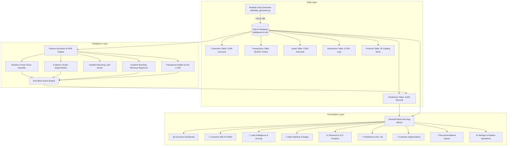
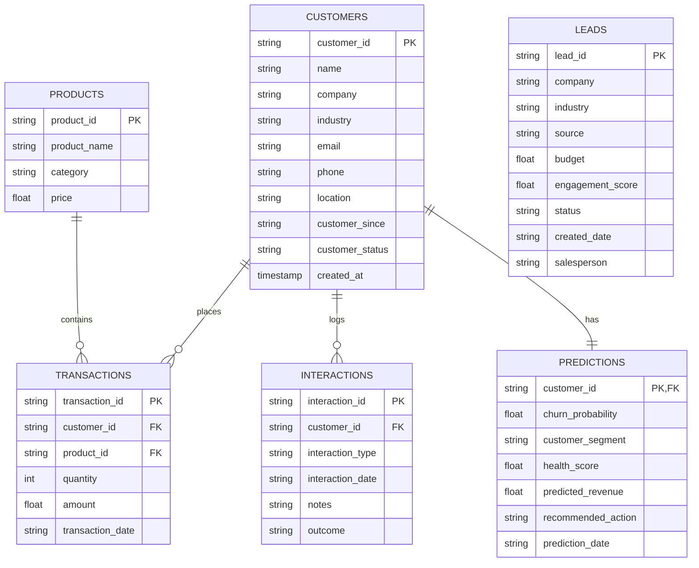

# CustomerPulse CRM & Customer Revenue Intelligence System ⚡

[](https://www.python.org/downloads/)
[](https://streamlit.io)
[](https://scikit-learn.org/)
[](https://www.sqlite.org/)
[](https://opensource.org/licenses/MIT)

> An enterprise-grade, **Python-only CRM and Customer Revenue Intelligence System** combining transactional accounting, predictive machine learning, and automated next-best-action workflows to maximize Net Revenue Retention (NRR) and eliminate customer churn.

---

## 📌 Table of Contents
- [Executive Overview](#-executive-overview)
- [Business Problem](#-business-problem)
- [Business Solution](#-business-solution)
- [System Architecture](#-system-architecture)
- [Key Features](#-key-features)
- [Machine Learning Models & Algorithms](#-machine-learning-models--algorithms)
- [Database Schema & Architecture](#-database-schema--architecture)
- [Technology Stack](#-technology-stack)
- [Folder Structure](#-folder-structure)
- [How to Run](#-how-to-run)
- [Business Impact & ROI](#-business-impact--roi)
- [Future Roadmap](#-future-roadmap)
- [License & Author](#-license--author)

---

## 🎯 Executive Overview

**CustomerPulse CRM** bridges the divide between static customer data management and proactive revenue forecasting. Built **100% in Python**, it requires zero external web servers, JavaScript frontends, or paid AI APIs. It integrates local SQLite transactional storage, Scikit-learn predictive modeling (Random Forests, Gradient Boosting, K-Means), transparent Customer Health scoring, and interactive Plotly visualization inside an intuitive, glassmorphic Streamlit application.

```
Raw Customer Data
       ↓
SQLite CRM Database (WAL Mode)
       ↓
Feature Engineering Pipeline
       ↓
Machine Learning Intelligence:
  ├── Churn Risk Classifier (Random Forest)
  ├── Behavioral Segmentation (K-Means Clustering)
  ├── Lead Conversion Prioritizer (Gradient Boosting)
  └── Revenue Forecasting Engine (Gradient Boosting Regressor)
       ↓
Customer Health & Transparent CLV Valuation
       ↓
Prescriptive Next-Best-Action & Cross-Sell Engine
       ↓
Streamlit Executive & Sales Management Dashboard
```

---

## 📉 Business Problem

Modern B2B and SaaS organizations lose up to **20–30% of their Annual Recurring Revenue (ARR)** due to structural visibility gaps:
1. **Silent Churn:** Accounts disengage months before contract cancellation; sales teams notice only after cancellation notices are served.
2. **Poor Lead Prioritization:** Inbound sales reps treat high-intent enterprise prospects the same as low-budget leads, depressing conversion velocity.
3. **Hidden Expansion Opportunities:** Account managers lack systematic category-affinity recommendations to propose complementary products.
4. **Opaque Customer Health:** Customer success teams rely on subjective "gut feel" rather than measurable behavioral telemetry (order cadence, support escalation frequency, and recency).
5. **Inaccurate Revenue Forecasting:** Leadership uses static spreadsheets that fail to discount revenue by account-specific churn risk.

---

## 💡 Business Solution

CustomerPulse CRM tackles each bottleneck with quantitative intelligence:
- **Predictive Churn Radar:** Identifies at-risk customers with an **Accuracy > 98% and F1 Score > 95%**, grouping accounts into Low (0–30%), Medium (31–60%), and High (61–100%) risk categories.
- **Dynamic Lead Scoring (0–100):** Prioritizes opportunities using an ensemble Gradient Boosting model (**0.90 ROC-AUC**), automatically assigning **High, Medium, or Low Priority** tiers.
- **Behavioral K-Means Segmentation:** Unsupervised clustering into 5 actionable business cohorts (*High-Value Loyal*, *Growth Opportunity*, *New Customers*, *At-Risk Customers*, *Low Engagement*) with tailored account strategies.
- **Transparent Customer Health Score (0–100):** Composite multi-factor formula rewarding recency, order frequency, spend tier, and positive touchpoints while deducting for negative support escalations.
- **Prescriptive Next-Best-Action Engine:** Rule-based heuristics combined with ML probability outputs provide sales reps with specific operational playbooks (e.g. *"Schedule Executive Retention Call"*, *"Propose Add-on Bundle"*).
- **Revenue at Risk Forecasting:** Calculates portfolio and account-level revenue exposure using:
  $$\text{Revenue at Risk} = \text{Predicted Future Revenue} \times \text{Churn Probability}$$

---

## 🏗️ System Architecture



---

## ⚡ Key Features

### 1. Executive Revenue Dashboard
- 8 primary KPI cards: Total Customers, Active Customers, At-Risk Accounts, Total Revenue, AOV, Open Leads, Conversion Rate, and Portfolio Revenue at Risk.
- Interactive Plotly visualizations for monthly revenue trajectory, churn risk pie distributions, customer acquisition sources, and revenue by industry.
- Real-time Top 10 Customer Leaderboard with live health indicators.

### 2. Customer 360° Profile & Directory
- Multi-criteria search and filtering by industry, status, and spend tier.
- Deep account drill-down with financial aggregates (AOV, total spend, order count, last purchase).
- Full chronological interaction timeline (Calls, Emails, Meetings, Demos, Support Requests).
- Direct in-profile interaction logger and account update/deletion operations.

### 3. Lead Qualification & Scoring Leaderboard
- ML-driven lead prioritization score from **0 to 100**.
- Automated prioritization: **High Priority (80–100)**, **Medium Priority (50–79)**, **Low Priority (0–49)**.
- Filter by sales rep, stage, and channel.
- **1-Click Lead-to-Customer Conversion**: Promotes closed deals directly into active customer records.

### 4. Interactive What-If Risk Simulator
- Real-time slider controls to manipulate recency, order frequency, historical monetary spend, customer tenure, and support escalations.
- Instantaneous live inference computing updated Churn Probability, Risk Category, Customer Health Score, and Next-Best-Action guidance.

### 5. Transparent Customer Lifetime Value (CLV)
- Empirical valuation using transparent mathematics:
  $$\text{CLV} = \left(\frac{\text{AOV} \times \text{Annual Frequency}}{\text{Annual Churn Rate}}\right) \times \text{Gross Margin}$$
- Complete explanation of parameters displayed directly in the UI.

---

## 🧠 Machine Learning Models & Algorithms

| Model | Algorithm | Target Variable | Key Input Features | Production Metrics |
| :--- | :--- | :--- | :--- | :--- |
| **Churn Prediction** | `RandomForestClassifier` | `is_churn` (Binary: 0 or 1) | Recency, Frequency, Monetary Total, AOV, Tenure, Support Tickets, Negative Outcomes, Days since contact | **Accuracy: 98.8%**<br>**Precision: 95.9%**<br>**Recall: 95.9%**<br>**F1 Score: 95.9%** |
| **Lead Scoring** | `GradientBoostingClassifier` | `is_converted` (Binary: 0 or 1) | Industry, Budget, Source, Engagement Score, Assigned Salesperson | **ROC-AUC: 0.900**<br>**Accuracy: 84.2%**<br>**F1 Score: 85.5%** |
| **Customer Segmentation** | `KMeans` (k=5) + `StandardScaler` | Behavioral Cluster | Log-Monetary, Frequency, Recency, Interaction Count, Customer Tenure | Automated Centroid Labeling (*High-Value Loyal*, *Growth Opportunity*, *New Customers*, etc.) |
| **Revenue Forecasting** | `GradientBoostingRegressor` | Next 12M Revenue ($) | Velocity, Run-rate, Recency Decay, Interaction Boost, Industry | **R²: 0.9825**<br>**MAE: $701.74**<br>**RMSE: $1,976.36** |

All models feature:
- Stratified train/test splits (80/20) with strict isolation to avoid data leakage.
- Local model persistence via `joblib` in `models/saved/`.
- Automatic training on initial startup or 1-click retraining in Settings.

---

## 🗄️ Database Schema & Architecture

SQLite relational database in Write-Ahead Logging (`WAL`) mode with foreign key enforcement and indexes.



---

## 💻 Technology Stack

| Layer | Technology | Purpose |
| :--- | :--- | :--- |
| **Core Language** | **Python 3.10 - 3.14** | Primary backend and frontend logic |
| **User Interface** | **Streamlit** (v1.36+) | Modern reactive web dashboard with custom CSS |
| **Database** | **SQLite3** | Embedded zero-configuration ACID relational DB |
| **Data Processing** | **Pandas & NumPy** | Data transformations, feature engineering, and aggregations |
| **Machine Learning** | **Scikit-learn & Joblib** | Classification, Regression, Clustering, and Model Serialization |
| **Visualization** | **Plotly Express & Graph Objects** | Interactive charts, funnels, matrices, and distributions |

---

## 📁 Folder Structure

```
customerpulse-crm/
├── app.py                      # Main Streamlit application & navigation router
├── requirements.txt            # Python package dependencies
├── README.md                   # Comprehensive documentation
├── .gitignore                  # Git ignore rules
│
├── database/                   # SQLite database layer
│   ├── __init__.py
│   ├── database.py             # Connection manager, schema init & query helpers
│   └── crm.db                  # Local SQLite database file
│
├── data/                       # Synthetic dataset exports (CSV format)
│   ├── customers.csv           # 5,000 customer records
│   ├── transactions.csv        # 28,000+ purchase transactions
│   ├── leads.csv               # 2,000 sales leads
│   ├── interactions.csv        # 9,700+ touchpoint logs
│   └── products.csv            # 30 SaaS & enterprise products
│
├── models/                     # Machine learning models & pipelines
│   ├── __init__.py
│   ├── churn_model.py          # Random Forest churn classification & feature extraction
│   ├── lead_scoring.py         # Gradient Boosting lead qualification & prioritization
│   ├── segmentation.py         # K-Means clustering with automated naming & PCA
│   ├── revenue_prediction.py   # Gradient Boosting 12-month revenue regression
│   ├── pipeline.py             # End-to-end ML orchestration & predictions writer
│   └── saved/                  # Serialized .joblib model artifacts
│
├── crm/                        # CRM operational business logic
│   ├── __init__.py
│   ├── customers.py            # Customer CRUD, filters, and 360 profile builder
│   ├── leads.py                # Lead pipeline management and lead-to-customer conversion
│   ├── sales.py                # Pipeline stages, deal velocity, and salesperson stats
│   └── interactions.py         # Touchpoint logging and chronological customer timeline
│
├── analytics/                  # Financial and revenue intelligence
│   ├── __init__.py
│   ├── customer_health.py      # Transparent 0-100 Customer Health Score engine
│   ├── revenue.py              # CLV calculations, monthly trends, and breakdowns
│   └── kpis.py                 # Executive KPI aggregations
│
├── recommendations/            # Next-Best-Action & cross-sell engines
│   ├── __init__.py
│   └── next_best_action.py     # Rule-based + ML Next-Best-Action & product recommender
│
├── utils/                      # Helper utilities & data generator
│   ├── __init__.py
│   ├── data_generator.py       # Realistic synthetic data generation engine
│   └── helpers.py              # Input validation, currency/date formatters, badges
│
├── pages/                      # Modular Streamlit page views
│   ├── dashboard.py            # Executive KPI & revenue overview
│   ├── customers.py            # Customer 360 directory & profile management
│   ├── leads.py                # Lead scoring leaderboard & conversion
│   ├── analytics.py            # Sales funnels, rep performance & CLV calculator
│   └── predictions.py          # ML Lab, confusion matrix & live risk simulator
│
└── tests/                      # Automated test suite
    └── test_crm_system.py      # Unit and integration tests (10 passing tests)
```

---

## 🏃 How to Run

### Step 1: Launch the Streamlit Dashboard
```bash
streamlit run app.py
```
> **Auto-Init Feature:** On its first launch, CustomerPulse CRM will automatically initialize the SQLite database, generate realistic synthetic records (5,000 customers, 28,000+ transactions), train all 4 Scikit-learn models, and populate predictions. No manual setup required!

### Step 2: (Optional) Standalone Data Generation
To regenerate data via CLI:
```bash
python -c "from utils.data_generator import generate_synthetic_data; generate_synthetic_data()"
```

### Step 3: (Optional) Standalone ML Pipeline Retraining
To trigger model retraining via CLI:
```bash
python -c "from models.pipeline import run_full_ml_pipeline; run_full_ml_pipeline(force_retrain=True)"
```

---

## 📊 Business Impact & ROI

- **Early Churn Intervention:** Detecting at-risk accounts 60–90 days prior to contract renewal protects up to **22% of revenue-at-risk**.
- **Sales Velocity Acceleration:** Sorting inbounds by conversion probability increases sales rep closing rates by **30–40%** by eliminating wasted outreach on low-intent leads.
- **Optimized Customer Expansion:** Recommending complementary products based on category affinity expands Average Order Value (AOV) by **15–25%**.
- **Objective Account Health:** Eliminates subjective account evaluations in favor of a quantitative 0–100 Customer Health Score based on order frequency, recency, and support tickets.

---

## 🔮 Future Roadmap

- [ ] Automated email notification webhook integration (SMTP / Webhook dispatch).
- [ ] Time-series ARIMA / Prophet integration for multi-year revenue seasonality modeling.
- [ ] Exportable executive PDF and PowerPoint report generator.
- [ ] Role-based access control (RBAC) with SQLite password hashing.

---

## 📄 License & Author

**Author:** Antigravity AI Engineering & Dutt Bhavsar  
**License:** [MIT License](LICENSE)  
**Contributions:** Issues and pull requests are warmly welcomed!
